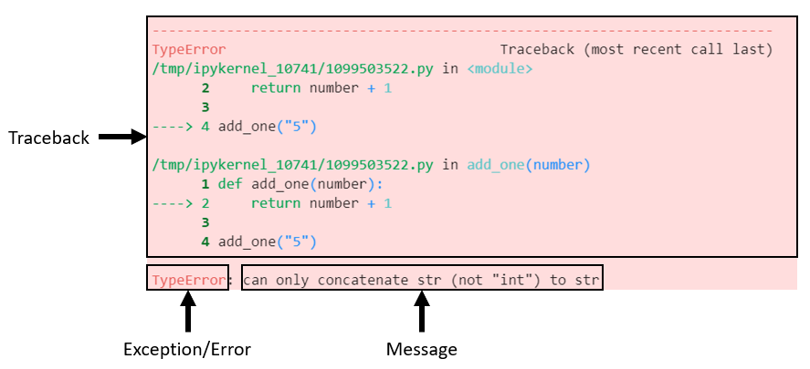
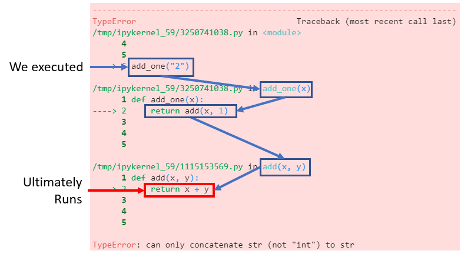
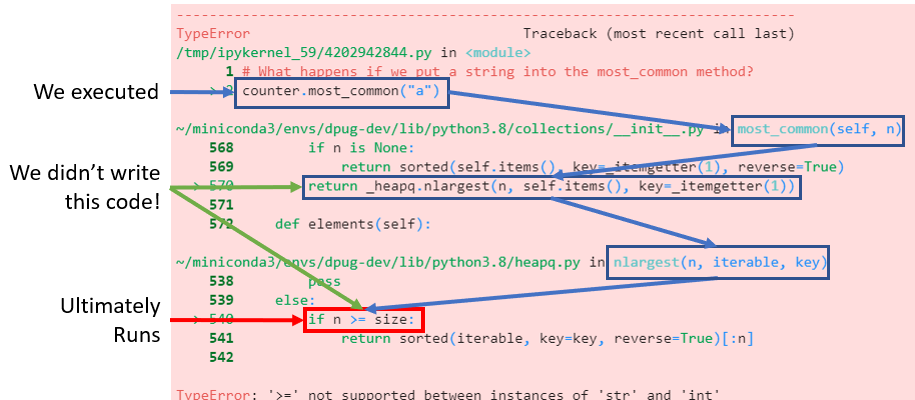

---
dpug:
  author: Cameron Riddell
  date: '2021-07-20'
jupytext:
  formats: md:myst
  notebook_metadata_filter: dpug,rise
  text_representation:
    extension: .md
    format_name: myst
    format_version: 0.13
    jupytext_version: 1.13.0
kernelspec:
  display_name: Python 3 (ipykernel)
  language: python
  name: python3
rise:
  scroll: true
---

+++ {"slideshow": {"slide_type": "slide"}, "tags": []}

# Exceptions - Following a traceback
This workshop will help you understand how to read and understand error messages in python.

## Learning Goals
* Understand what Exceptions are and differentiate from the traceback
* Read and interpret a traceback for easier debugging
* When/how to use Exceptions in my own code
* Seeking help when encountering an error

+++ {"tags": []}

## Terminology
* **Error/Exception**: A value and/or message informing a user that something unexpected has occurred and that the script should not continue running.

* **Traceback**: A traceback is a message that points to where in the code an error has occurred.

+++

<div class="alert alert-info">
    <font size="4">Exceptions tell you <b>what</b> went wrong, tracebacks tell you <b>where</b> it went wrong</font>
</div>

+++



+++ {"slideshow": {"slide_type": "slide"}, "tags": []}

## Common exceptions and common causes

| Exception    | Interpretation | Generic Solution | Python Docs Link |
|--------------|-----------|------------|-------------|
| [SyntaxError](#syntaxerror) | python can not read some of the code you wrote | Review your code and make sure you have no open quotes, brackets, parentheses. If you ever see a SyntaxError traceback where nothing looks wrong, check the line of code above it. | [docs](https://docs.python.org/3/library/exceptions.html#SyntaxError) |
[TypeError](#typeerror)       | You've called a function/method and one of your arguments is of the wrong type | Check the types of each argument that you're passing into the function in question. Ensure each argument you're passing is appropriate for the function at hand | [docs](https://docs.python.org/3/library/exceptions.html#TypeError)
[ValueError](#valueerror)     | You've provided a value into a function that it cannot use | Check the function you're calling, if it requires specific values (e.g. a positive number, a limited number of choices of strings, etc) make sure that your argument falls within those values | [docs](https://docs.python.org/3/library/exceptions.html#ValueError)
[IndexError](#indexerror)     | The object you are trying to index is either not indexable, or does not have an index corresponding to your selection | Double check the index number you are using to index and ensure it is not greater than the length of the container object. | [docs](https://docs.python.org/3/library/exceptions.html#IndexError)
[ModeuleNotFoundError](#modulenotfounderror) | You're trying to import a package without having installed it first |  Ensure you do not have a typo in the package name at import statement (variable names are case sensitive too!). If there are no typos, check your package managers (typically `pip` or `conda` to ensure you have the specific package installed. If you are using a virtual environment manager, check that the correct virtual environment is active. | [docs](https://docs.python.org/3/library/exceptions.html#ModuleNotFoundError)
[NameError](#nameerror) | You are attempting to reference a variable that does not exist. | Ensure you have spelled your variable name correctly. Additionally, if you are working within a notebook, double check that have run the specific cell that defines your variable. | [docs](https://docs.python.org/3/library/exceptions.html#NameError)
[AttributeError](#attributeerror) | You attempted to access an attribute of an object that does not exist | You trying to access an attribute on an object that does not exist | [docs](https://docs.python.org/3/library/exceptions.html#AttributeError)

+++ {"slideshow": {"slide_type": "slide"}, "tags": []}

### SyntaxError
**Python can't parse/read some of the code you wrote**

**Solution**: Review your code and make sure you have no open quotes, brackets, parentheses

```{code-cell} ipython3
---
slideshow:
  slide_type: subslide
tags: [raises-exception]
---
# Missing closing quote
a = "1
```

```{code-cell} ipython3
---
slideshow:
  slide_type: notes
tags: [raises-exception]
---
# Missing closing parentheses
a = (1, 2
```

```{code-cell} ipython3
:tags: [raises-exception]

# Missing colon
for i in range(5)
    pass
```

+++ {"tags": []}

#### Less helpful SyntaxErrors
Sometimes python's SyntaxErrors aren't exactly helpful...

**Solution**: If you ever see a SyntaxError traceback where nothing looks wrong, check the line of code above it.

```{code-cell} ipython3
:tags: [raises-exception]

# The traceback indicates an issue on line 3, whereas the issue is actually on line 2
x = (1, 2,
y = 3
```

```{code-cell} ipython3
:tags: [raises-exception]

# The traceback indicates an issue on line 5, whereas the issue is actually on line 4
my_dict = {
    "hello": 1,
    "world": 3
    "foo": 4,
    "bar": 5
}
```

+++ {"slideshow": {"slide_type": "slide"}, "tags": []}

### TypeError
**A function/method was given an argument of the wrong type**

**Solution**: Check the types of each argument that you're passing into the function in question. Ensure each argument you're passing is appropriate for the function at hand

```{code-cell} ipython3
---
slideshow:
  slide_type: subslide
tags: []
---
integer_list = [1, 2, 3]
sum(integer_list)
```

```{code-cell} ipython3
---
slideshow:
  slide_type: fragment
tags: [raises-exception]
---
string_list = ["a", "b", "c", "d"]
sum(string_list)
```

### TypeError - Not callable
**You are attempting to call a function, however the object you are using is not a function\***

What is function calling?
Function calling is when you invoke a function by using parentheses.


* Note: more specifically, the object you are trying to call does not define a `__call__` dunder method, which is not limited to just function objects.

```{code-cell} ipython3
# Defining the function object
def addition(x, y):
    return x + y

addition(1, 2) # I'm now calling the function, works as expected
```

```{code-cell} ipython3
:tags: [raises-exception]

# Whoops, we overwrote the function name with a variable that points to an integer
addition = 5

# addition no longer references a function and instead points to an integer
# An integer is not callable (it doesn't define how to handle opening/closing parentheses)
#   so an error is raised
addition(1, 2) 
```

+++ {"heading_collapsed": true, "tags": []}

### ValueError
**You've provided a value into a function that it cannot use**

Similar to a TypeError in terms of its logic (e.g. 'this function received something it doesn't know how to work with), but differentiates in that this is used to raise an Error when the type of the passed argument is correct.

**Solution**: Check the function you're calling, if it requires specific values (e.g. a positive number, a limited number of choices of strings, etc) make sure that your argument falls within those values

```{code-cell} ipython3
import math
math.sqrt(100) # works as expected
```

```{code-cell} ipython3
:tags: [raises-exception]

math.sqrt(-100) # does not return imaginary numbers, instead raises an Exception
```

```{code-cell} ipython3
:tags: [raises-exception]

# For comparison, this snippet raises a TypeError
#   note that we're passing a string into `math.sqrt`
math.sqrt("100")
```

+++ {"heading_collapsed": true, "tags": []}

### IndexError
**The object you are trying to index is either not indexable, or does not have an index corresponding to your selection.**

These are common to encounter with container-like objects. (e.g. lists, tuples, sets, arrays)

**Solution**: Double check the index number you are using to index and ensure it is not greater than the length of the container object.

```{code-cell} ipython3
# successful indexing
x = ["a", "b", "c"]
x[1]  # get the second item from the list
```

```{code-cell} ipython3
:tags: [raises-exception]

x[10] # get the 10th item from the list
```

```{code-cell} ipython3
:tags: [raises-exception]

# A method can also raise an IndexError if that method attempts to index an item from the object
x.pop(10)
```

+++ {"tags": []}

### ModuleNotFoundError
**You're trying to import a package without having installed it first**

**Solution**: Ensure you do not have a typo in the package name at import statement (variable names are case sensitive too!). If there are no typos, check your package managers (typically `pip` or `conda` to ensure you have the specific package installed. If you are using a virtual environment manager, check that the correct virtual environment is active.

```{code-cell} ipython3
# runs successfully, as expected
import collections
```

```{code-cell} ipython3
:tags: [raises-exception]

# error, we have not installed a package named `does_not_exist`
import does_not_exist
```

```{code-cell} ipython3
:tags: [raises-exception]

# common: watch out for typos!
import colections
```

+++ {"slideshow": {"slide_type": "slide"}, "tags": []}

### NameError
**You are attempting to reference a variable that does not exist**

**Solution**: Ensure you have spelled your variable name correctly. Additionally, if you are working within a notebook, double check that have run the specific cell that defines your variable.

```{code-cell} ipython3
---
slideshow:
  slide_type: subslide
tags: [raises-exception]
---
memoization = 0
print(memoization)
```

```{code-cell} ipython3
:tags: [raises-exception]

print(memoizaton)
```

### AttributeError
**You trying to access an attribute on an object that does not exist**

**Solution**:
1. Check you have correctly spelled the attribute
2. Check the object you are operating, to ensure it is what you think it is.

```{code-cell} ipython3
import datetime as dt
todays_date = dt.datetime.today()
print(todays_date)
```

```{code-cell} ipython3
:tags: []

# Accessing the year attribute from the datetime object
todays_date.year
```

```{code-cell} ipython3
:tags: [raises-exception]

# Misspelled attribute raises AttributeError
todays_date.yer
```

```{code-cell} ipython3
:tags: [raises-exception]

# Accidental overitten variable raises AttributeError
todays_date = 5
todays_date.year  # variable `todays_date` is no longer a datetime object. It is an integer.
```

## Tracebacks From Our Functions
So far we have only discussed errors where the only code in the traceback is code we've written. However, code is never this simple. Lets take a look at more realistic scenarios where errors are encountered within functions and generate much longer tracebacks that include a lot of code we haven't seen before.

It is common practice for functions to be nested- meaning that functions are called inside of functions. For each level of nesting, we will see a slightly longer traceback.

```{code-cell} ipython3
:tags: [raises-exception]

def add(x, y):
    return x + y


add("2", 1)
```

```{code-cell} ipython3
:tags: [raises-exception]

def add_one(x):
    return add(x, 1)


add_one("2")
```

<div class="alert alert-info">
    Note that the traceback became longer when we called `add` from within `add_one` because python wants to show us all of the code that was executed between the code we wrote, and where the error occurred.
</div>

Encountering nested functions like this, is extremely common. So it's important that you can follow these longer tracebacks to help you debug your own code.

Lets look at example where we import an external library and encounter an error in code we haven't written ourselves.

+++

### Breakdown a Nested Traceback
**Using the example above, lets follow the execution path that led to the error.**

This help us understand what function calls were made that led to the raising of the error



+++

## Tracebacks From External Functions

It is common practice to use external libraries in python. When doing so you have access to tons of code that other python users have written. Our tracebacks can become a little funny looking because now we end up seeing code that we have neither written, nor read before. It is important to be able to follow the execution path of code even when you did not write all of the code that is in a given traceback.

```{code-cell} ipython3
import collections

# A Counter object returns a dictionary of unique values along with how many times they were observed
counter = collections.Counter("aaaabbbccd")
counter
```

```{code-cell} ipython3
# This Counter object has a few more methods than a normal dictionary
#  To get the 2 most commonly encountered values:
counter.most_common(2)
```

```{code-cell} ipython3
:tags: [raises-exception]

# What happens if we put a string into the most_common method?
counter.most_common("a")
```

### Breakdown an External Traceback



+++

## Using Errors in your own code

Sometimes it is necessary to raise errors in your own code. Whether you want to limit the range of possible inputs for a function, or want to avoid catastrophic failure of your code, errors are a useful way of conveying to a user that something has gone wrong.

+++

### Raise your own errors

```{code-cell} ipython3
# Errors can be made, just like any other object in python
my_error = ValueError("this is a message")
my_error
```

<div class="alert alert-info">
    
**Note** that with the above code, the error did not do anything. We simply created an error object. In order to have the error object stop python from executing code, we will need to raise it.
</div>

```{code-cell} ipython3
:tags: [raises-exception]

# Errors can be throw by using the `raise` statement
raise my_error
```

<div class="alert alert-info">

**Note** both the error type and message we wrote ourselves was included in the output!

Now lets explore some occasions that we may want to throw our own errors to prevent users from misusing our functions.
</div>

+++

#### Raise Your Own Errors - Example

```{code-cell} ipython3
:tags: []

def add_then_multiply(x, y, multiplier=1):
    return (x + y) * multiplier

# adds 3 + 5, multiplies the result by 2
add_then_multiply(4, 5, multiplier=2)
```

Our `add_then_multiply` function works as expected. First we add 4 + 5 together. Then we multiply their sum by 2.

Let's see what happens when we change the `multiplier` argument from an number (integer/float) to a string.

```{code-cell} ipython3
:tags: [raises-exception]

add_then_multiply(4, 5, multiplier="2")
```

Well that was unexpected, the function still works despite our multiplier value being a string, however, the output is very odd though- a repeating string of "2"s?

Let's see if we can use our own Exception to ensure only numbers can be passed into our function. We're going to use a `TypeError` when an inappropriate type of value is passed into the multiplier argument (e.g. any value that is not an integer or float).

```{code-cell} ipython3
:tags: [raises-exception]

def add_then_multiply(x, y, multiplier=1):
    if not isinstance(multiplier, (int, float)):
        raise TypeError("multiplier must be an integer or float")
    return (x + y) * multiplier

add_then_multiply(3, 5, multiplier="2")
```

Now instead of having an unexpected result, we raise an informative error indicating that this function is not supposed to receive a non-number for its `multiplier` argument.

+++ {"tags": []}

## Handling Errors - try, except, else, and finally
Sometimes you expect to receive an error and want to run a snippet of code in order to handle that error.

The try...except code-block has many more features than described here, however they are outside the scope of this article so we won't get into them here.

```{code-cell} ipython3
# Any set up code should exist boutside of the try block.
#  In general, the try block should not contain many lines of code.
#  Just the lines of code that raise an Exception

x = [1, 2, 3]

try:
    # The code that may raise an error should occur here.
    x[10] # this will raise an IndexError
except IndexError:
    # This block will be executed if an IndexError occurred in the `try` block
    #   if this block does not explicitly raise an error, the error can be ignored.
    print("There was an error!")
else:
    # This block is only executed if NO error has occurred
    print("no error occurred")
finally:
    # anything in this block will always be executed, even if an error is encoutnered
    print("I will always be executed")
```

+++ {"slideshow": {"slide_type": "slide"}}

## Challenge! - See if you can fix these errors

```{code-cell} ipython3
:tags: [raises-exception]

# Challenge 1 - fix the import statement
improt collections
```

```{code-cell} ipython3
:tags: [raises-exception]

# Challenge 2 - pop the last element of the list
x = ["a", "b", "c"]
x.pop(3)
print(x)
```

```{code-cell} ipython3
:tags: [raises-exception]

# Challenge 3 - Fix the SyntaxError
if True:
    if True:
        print(((123))

if not False:
    print(456)
```

```{code-cell} ipython3
:tags: [raises-exception]

# Challenge 4 - Fix the SyntaxError
for i in range(3):
    print(("loop counter", i)
    if i <= 1
        print("inside if statement:", i)
```

```{code-cell} ipython3
:tags: [raises-exception]

# Challenge 5 - Write your own code to make the longest traceback possible!
```

## Bonus! Errors in Python >= 3.10
Python 3.10 (which is currently not released at the time of writing) has revamped the usefulness of tracebacks! The new Error messages are much more specific, especially when it comes to syntax errors.

https://realpython.com/lessons/better-error-messages/
